# Solución – Lab P3: Cliente React para BluePrints (Redux + Axios + JWT)

## Regresar al [README](./README.md)

| Nombre | Rol |
|--------|-----|
| [Juan David Valero Abril](https://github.com/Valero25) | Estudiante |
| [Juan Esteban Sanchez Garcia](https://github.com/juanesgl) | Estudiante |

---

## Contenido

1. [Resumen](#1-resumen)
2. [Arquitectura de repositorios](#2-arquitectura-de-repositorios)
3. [Tecnologías](#3-tecnologías)
4. [Cómo ejecutar el laboratorio](#4-cómo-ejecutar-el-laboratorio)
5. [Estructura del proyecto](#5-estructura-del-proyecto)
6. [Integración con el backend (Lab P2)](#6-integración-con-el-backend-lab-p2)
7. [Requerimientos del laboratorio](#7-requerimientos-del-laboratorio)
8. [Actividades sugeridas](#8-actividades-sugeridas)
9. [Punto de partida y errores corregidos](#9-punto-de-partida-y-errores-corregidos)
10. [Evidencias con el backend real](#10-evidencias-con-el-backend-real)
11. [Solución de problemas](#11-solución-de-problemas)
12. [Conclusiones](#12-conclusiones)

---

## 1. Resumen

Se construyó una **Single Page Application** en React que moderniza el cliente HTML/JS de BluePrints. La aplicación permite:

- Consultar los planos de un autor y verlos en una tabla con el total de puntos y un ranking Top‑5.
- Abrir un plano y dibujarlo en un lienzo (`canvas`) de 520×360.
- Agregar puntos haciendo clic en el lienzo y guardarlos en el backend.
- Crear planos desde un formulario con lienzo interactivo y eliminar planos.
- Iniciar sesión con JWT; la creación, edición y eliminación están protegidas.
- Trabajar con datos simulados (`apimock`) o con el API real (`apiClient`) cambiando una sola variable.

| Verificación | Resultado |
|--------------|-----------|
| Pruebas (`npm test`) | 44 pruebas en 6 archivos, todas en verde |
| Lint (`npm run lint`) | Sin errores |
| Formato (Prettier) | Todo el código formateado |
| Build (`npm run build`) | Compila correctamente |
| Integración con el backend real | Login, consultas, creación, guardado y eliminación verificados |

---

## 2. Arquitectura de repositorios

El laboratorio está dividido en **dos repositorios independientes**; el frontend no contiene código del backend y se comunican solo por HTTP.

| Repositorio | Contenido | Puerto |
|-------------|-----------|--------|
| [Lab_P3_BluePrints_React_UI](https://github.com/juanesgl/Lab_P3_BluePrints_React_UI) (este) | Frontend: SPA en React + Vite | `5173` |
| [Lab_P2_BluePrints_Java21_API_Security_JWT](https://github.com/juanesgl/Lab_P2_BluePrints_Java21_API_Security_JWT) | Backend: API REST Spring Boot + JWT + PostgreSQL | `8080` |

```text
Navegador ──► http://localhost:5173 (Vite)
                 │  /api/*  ──proxy──►  http://localhost:8080/*  (Spring Boot, repo P2)
                 │                          └──► PostgreSQL :5432
```

---

## 3. Tecnologías

| Tecnología | Uso |
|------------|-----|
| React 18 + Vite 7 | SPA y servidor de desarrollo con proxy |
| Redux Toolkit + React Redux | Estado global: slices, thunks y selectores memorizados |
| Axios | Cliente HTTP con interceptores JWT |
| React Router 6 | Navegación y rutas protegidas |
| Vitest + Testing Library + jsdom | Pruebas unitarias, de componentes y de integración |
| ESLint + Prettier | Lint y formato |
| GitHub Actions | CI: lint + test + build |
| Docker + nginx | Empaquetado del frontend junto al backend (opcional) |

---

## 4. Cómo ejecutar el laboratorio

### 4.1 Requisitos

| Herramienta | Versión | Uso |
|-------------|---------|-----|
| Node.js | 18 o superior (probado con 22) | Frontend |
| Java | 21 | Backend (solo modo API real) |
| Maven | 3.9+ | Backend (solo modo API real) |
| Docker Desktop | opcional | PostgreSQL del backend / `docker compose` |

### 4.2 Instalación

```bash
git clone https://github.com/juanesgl/Lab_P3_BluePrints_React_UI.git
cd Lab_P3_BluePrints_React_UI
npm install
cp .env.example .env
```

### 4.3 Variables de entorno (`.env`)

```env
# true  -> usa apimock (datos en memoria, no requiere backend)
# false -> usa apiClient (API REST real con Axios)
VITE_USE_MOCK=true

# URL base que usa Axios. '/api' pasa por el proxy de Vite (evita CORS en desarrollo)
VITE_API_BASE_URL=/api

# Backend al que el proxy de Vite reenvía las peticiones /api
VITE_API_PROXY_TARGET=http://localhost:8080
```

> Vite lee el `.env` al arrancar: después de cambiar una variable hay que **reiniciar** `npm run dev`.

**¿Por qué un proxy?** El backend del Lab P2 **no tiene CORS configurado**, así que el navegador bloquearía las peticiones de `localhost:5173` a `localhost:8080`. El proxy de Vite recibe `/api/...`, elimina el prefijo y reenvía al backend (`vite.config.js`):

```js
server: {
  port: 5173,
  // El backend (Lab P2) no tiene CORS: en desarrollo las peticiones a /api se reenvían a él
  proxy: {
    '/api': {
      target: env.VITE_API_PROXY_TARGET || 'http://localhost:8080',
      changeOrigin: true,
      rewrite: (path) => path.replace(/^\/api/, ''),
    },
  },
},
```

| Petición del frontend | Petición que recibe el backend |
|-----------------------|--------------------------------|
| `GET /api/blueprints/john` | `GET /blueprints/john` |
| `POST /api/auth/login` | `POST /auth/login` |

### 4.4 Modo mock (sin backend)

1. En `.env`: `VITE_USE_MOCK=true`.
2. `npm run dev` y abrir `http://localhost:5173`. El encabezado muestra la insignia **Mock**.

| Autor | Planos |
|-------|--------|
| `john` | `house`, `garage`, `roof`, `fence`, `garden`, `window` (6 planos, 21 puntos) |
| `mary` | `office`, `bridge` |

Usuarios de prueba: `student / student123` y `assistant / assistant123` (en modo mock ambos pueden escribir). Los cambios en modo mock se pierden al recargar.

### 4.5 Modo API real

**Backend (repositorio Lab P2):**

```bash
git clone https://github.com/juanesgl/Lab_P2_BluePrints_Java21_API_Security_JWT.git
cd Lab_P2_BluePrints_Java21_API_Security_JWT
git checkout feat/delete-y-scope-write   # rama con DELETE y scope de escritura (ver sección 6.1)
docker compose up -d          # PostgreSQL en el puerto 5432
mvn spring-boot:run           # API en http://localhost:8080 (Swagger: /swagger-ui.html)
```

**Frontend:** en `.env` poner `VITE_USE_MOCK=false`, ejecutar `npm run dev` (la insignia muestra **API**) e iniciar sesión:

| Usuario | Contraseña | Scopes | Puede |
|---------|------------|--------|-------|
| `student` | `student123` | `blueprints.read` | Consultar (crear, guardar y eliminar responden 403) |
| `assistant` | `assistant123` | `blueprints.read blueprints.write` | Consultar, crear, guardar puntos y eliminar |

### 4.6 Scripts

| Script | Descripción |
|--------|-------------|
| `npm run dev` | Servidor de desarrollo |
| `npm run build` | Build de producción en `dist/` |
| `npm run preview` | Previsualiza el build |
| `npm run lint` | ESLint |
| `npm run format` | Prettier |
| `npm test` | Pruebas con Vitest (usan el mock, no requieren backend) |

### 4.7 Docker (opcional)

```bash
docker compose up --build
```

| Servicio | Origen | Puerto |
|----------|--------|--------|
| `web` | `Dockerfile` de este repo: build de Vite servido por nginx | `5173 → 80` |
| `backend` | Construido **directamente desde el repositorio de GitHub del Lab P2** | `8080` |
| `db` | `postgres:17-alpine` | interno |

nginx sirve la SPA y reenvía `/api/*` al backend (`docker/nginx.conf.template`):

```nginx
# /api/blueprints -> ${BACKEND_URL}/blueprints
location /api/ {
  proxy_pass ${BACKEND_URL}/;
  proxy_set_header Host $host;
  proxy_set_header Authorization $http_authorization;
}

# Fallback de la SPA para las rutas de React Router
location / {
  try_files $uri $uri/ /index.html;
}
```

Por defecto el backend se construye desde la rama `main` de GitHub; mientras los cambios de la sección 6.1 no estén publicados allí, usar la copia local:

```bash
BACKEND_CONTEXT=../Lab_P2_BluePrints_Java21_API_Security_JWT docker compose up --build
```

### 4.8 Rutas de la aplicación

| Ruta | Página | Protegida |
|------|--------|-----------|
| `/` | Consulta por autor, tabla, Top‑5, lienzo y edición | No (editar y eliminar requieren sesión) |
| `/blueprints/:author/:name` | Detalle de un plano | No |
| `/create` | Crear blueprint (formulario + lienzo) | **Sí** |
| `/login` | Inicio de sesión | No |
| `*` | 404 | No |

---

## 5. Estructura del proyecto

```text
Lab_P3_BluePrints_React_UI/
├─ src/
│  ├─ components/
│  │  ├─ BlueprintCanvas.jsx      # Lienzo 520×360: segmentos, puntos y clic para agregar
│  │  ├─ BlueprintForm.jsx        # Formulario de creación con validación y lienzo interactivo
│  │  ├─ BlueprintList.jsx        # Ranking Top‑5 con barras proporcionales
│  │  ├─ ErrorBanner.jsx          # Aviso de error con botón Reintentar
│  │  ├─ PrivateRoute.jsx         # Protege rutas que requieren JWT
│  │  └─ Spinner.jsx              # Indicador de carga
│  ├─ features/
│  │  ├─ auth/authSlice.js        # Sesión: login, logout y token
│  │  └─ blueprints/
│  │     ├─ blueprintsSlice.js    # Thunks, estado por petición, actualizaciones optimistas
│  │     └─ selectors.js          # Selectores memorizados (Top‑5, total, puntos sin guardar)
│  ├─ pages/                      # BlueprintsPage, BlueprintDetailPage, CreateBlueprintPage, LoginPage, NotFound
│  ├─ services/
│  │  ├─ http.js                  # Instancia Axios + interceptores + traducción de errores
│  │  ├─ apiClient.js             # Implementación contra el API REST real
│  │  ├─ apimock.js               # Implementación en memoria
│  │  ├─ blueprintsService.js     # Selecciona mock o API con VITE_USE_MOCK
│  │  └─ authService.js           # Login real o simulado según el mismo flag
│  ├─ store/index.js              # Store (blueprints + auth)
│  └─ App.jsx, main.jsx, styles.css
├─ tests/                         # 6 archivos, 44 pruebas
├─ docker/nginx.conf.template     # nginx: SPA + proxy /api → backend
├─ img/                           # Evidencias
├─ .github/workflows/ci.yml
└─ Dockerfile, docker-compose.yml, vite.config.js, vitest.config.js
```

**Flujo de datos:**

```text
Componente ──dispatch(thunk)──► blueprintsSlice ──► blueprintsService ──► apimock | apiClient ──► http (Axios + JWT) ──► /api (proxy) ──► Backend
     ▲                                  │
     └────────── useSelector ◄──────────┘  (estado por petición: idle / loading / succeeded / failed)
```

---

## 6. Integración con el backend (Lab P2)

Antes de conectar el frontend se revisaron los controladores y la configuración de seguridad del backend. Hay diferencias con los endpoints propuestos en el enunciado; las de contrato se resolvieron en el frontend y las funcionales se completaron en el backend (sección 6.1):

| Aspecto | Enunciado | Backend real | Decisión |
|---------|-----------|--------------|----------|
| Prefijo de rutas | `/api/blueprints` | `/blueprints` | Front: proxy `/api/*` → `/*` |
| Login | `POST /api/auth/login` → `{ token }` | `POST /auth/login` → `{ access_token, token_type, expires_in }` | Front: se lee `access_token` |
| Actualizar | `PUT /api/blueprints/{author}/{name}` | `PUT /blueprints/{author}/{name}/points` con **un** punto | Front: un PUT por cada punto nuevo |
| Eliminar | `DELETE ...` | No existía | Back: se agregó `DELETE`; front: eliminación optimista con reversión |
| Escritura | — | Ningún usuario tenía `blueprints.write` | Back: `assistant` recibe el scope de escritura |
| CORS | — | No configurado | Front: proxy de Vite (desarrollo) y nginx (Docker) |
| Lecturas | Públicas | Requieren `blueprints.read` | Front: los autores se cargan tras iniciar sesión |

| Método | Endpoint (backend) | Scope | Respuesta | Uso |
|--------|--------------------|-------|-----------|-----|
| POST | `/auth/login` | público | 200 / 401 | Autenticación |
| GET | `/blueprints` | `blueprints.read` | 200 | Autores |
| GET | `/blueprints/{author}` | `blueprints.read` | 200 / 404 | Tabla de planos |
| GET | `/blueprints/{author}/{name}` | `blueprints.read` | 200 / 404 | Abrir plano |
| POST | `/blueprints` | `blueprints.write` | 201 / 403 (ya existe) | Crear plano |
| PUT | `/blueprints/{author}/{name}/points` | `blueprints.write` | 202 / 404 | Agregar punto |
| DELETE | `/blueprints/{author}/{name}` | `blueprints.write` | 204 / 404 | Eliminar plano |

### 6.1 Cambios en el backend

Los cambios se hicieron en el repositorio del backend, en la rama `feat/delete-y-scope-write`, manteniendo los dos repositorios independientes.

**Usuario con permisos de escritura** (`security/InMemoryUserService.java`). `student` queda solo con lectura para evidenciar el 403:

```java
this.userScopes = Map.of(
    "student", "blueprints.read",
    "assistant", "blueprints.read blueprints.write"
);
```

**Nuevo endpoint `DELETE`** (`controllers/BlueprintsAPIController.java`):

```java
// DELETE /blueprints/{author}/{bpname}
@Operation(summary = "Eliminar un plano", description = "Elimina un plano existente junto con todos sus puntos.")
@ApiResponses(value = {
        @ApiResponse(responseCode = "204", description = "Plano eliminado correctamente"),
        @ApiResponse(responseCode = "404", description = "El plano que se intenta eliminar no existe")
})
@PreAuthorize("hasAuthority('SCOPE_blueprints.write')")
@DeleteMapping("/{author}/{bpname}")
public ResponseEntity<?> delete(@PathVariable String author, @PathVariable String bpname) {
    try {
        services.deleteBlueprint(author, bpname);
        return ResponseEntity.noContent().build();
    } catch (BlueprintNotFoundException e) {
        return ResponseEntity.status(HttpStatus.NOT_FOUND).body(Map.of("error", e.getMessage()));
    }
}
```

**Servicio y persistencia** (`services/BlueprintsServices.java`, `persistence/BlueprintPersistence.java` y `persistence/PostgresBlueprintPersistence.java`). Los puntos se eliminan en cascada:

```java
// BlueprintsServices
public void deleteBlueprint(String author, String name) throws BlueprintNotFoundException {
    persistence.deleteBlueprint(author, name);
}

// PostgresBlueprintPersistence
@Override
@Transactional
public void deleteBlueprint(String author, String name) throws BlueprintNotFoundException {
    repository.delete(getBlueprint(author, name));
}
```

**Evidencia 18 – Swagger del backend con el nuevo endpoint `DELETE`:**

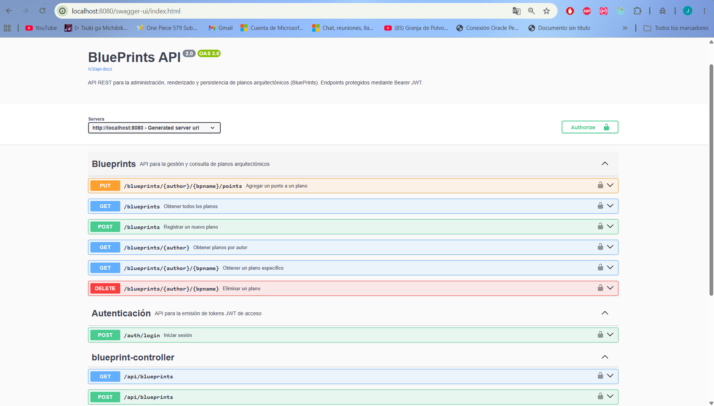

**Prueba funcional realizada** (código del frontend contra el backend real con PostgreSQL):

| Usuario | Operación | Resultado |
|---------|-----------|-----------|
| `assistant` | Crear `john/e2e-front` | 201, aparece en la tabla |
| `assistant` | Crear el mismo plano otra vez | *"Blueprint already exists: john/e2e-front (403)."* |
| `assistant` | Agregar 2 puntos con clic y **Guardar Cambios** | 202; al releer del backend tiene 4 puntos |
| `assistant` | **Eliminar** | 204; desaparece de la tabla y releerlo da 404 |
| `student` | Eliminar `garage` | 403; la fila se restaura (reversión optimista) |
| `student` | Guardar puntos / crear | 403 *"Permisos insuficientes"*; la tabla se restaura |

---

## 7. Requerimientos del laboratorio

### 7.1 Canvas

Componente `BlueprintCanvas` (`src/components/BlueprintCanvas.jsx`) con identificador propio y dimensiones de **520×360**:

```jsx
export default function BlueprintCanvas({
  id = 'blueprint-canvas',
  points = [],
  width = 520,
  height = 360,
  onAddPoint,
}) {
  const ref = useRef(null)
  // ...
  return (
    <canvas
      id={id}
      data-testid={id}
      ref={ref}
      width={width}
      height={height}
      onClick={handleClick}
      aria-label="Lienzo del blueprint"
      className="blueprint-canvas"
      style={{ maxWidth: width, cursor: onAddPoint ? 'crosshair' : 'default' }}
    />
  )
}
```

- La página principal usa `blueprint-canvas`, la de creación `create-canvas` y la de detalle `detail-canvas`.
- El `max-width` permite adaptarse a pantallas pequeñas sin deformar el dibujo.
- Fondo oscuro con cuadrícula cada 40 px.

**Evidencia 1 – Página inicial con el lienzo:**

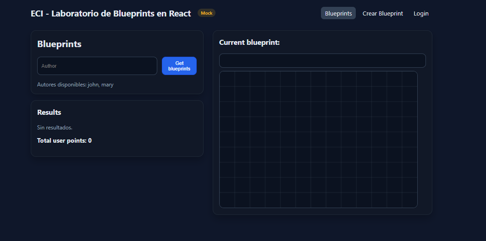

**Evidencia 2 – Canvas con su identificador y dimensiones en DevTools:**

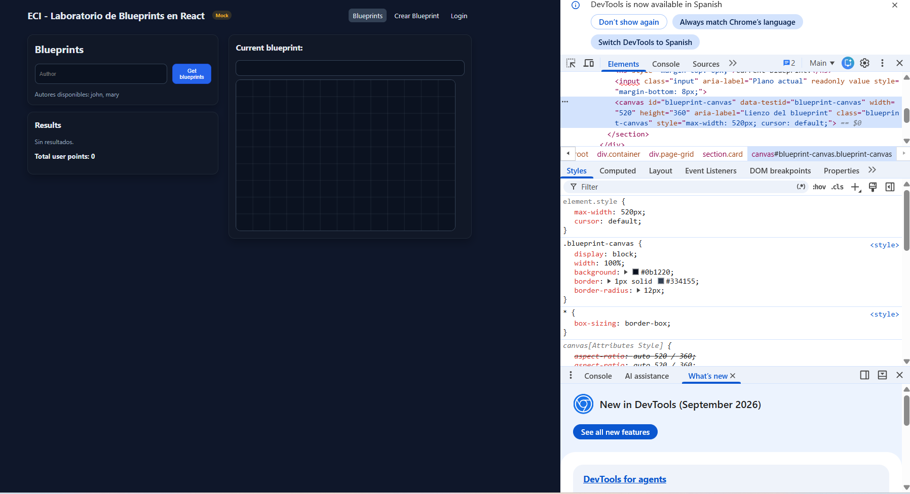

### 7.2 Listar los planos de un autor

En `BlueprintsPage` el usuario escribe un autor (con sugerencias mediante `datalist`) y pulsa **Get blueprints**, que despacha `fetchByAuthor(author)`:

```js
export const fetchByAuthor = createAsyncThunk(
  'blueprints/fetchByAuthor',
  withMessage(async (author) => {
    const items = await blueprintsService.getByAuthor(author)
    return { author, items }
  }),
)
```

La tabla muestra:

| Columna | Contenido |
|---------|-----------|
| Blueprint name | Nombre del plano (enlace a su página de detalle) |
| Number of points | Cantidad de puntos |
| Acciones | Botón **Open** (y **Eliminar** con sesión iniciada) |

Debajo se muestra el **total de puntos del autor**, calculado con un selector memorizado:

```js
export const selectTotalPoints = createSelector([selectBlueprintsByAuthor], (items) =>
  items.reduce((acc, bp) => acc + (bp.points?.length || 0), 0),
)
```

**Evidencia 3 – Tabla de planos del autor `john` con total y Top‑5:**

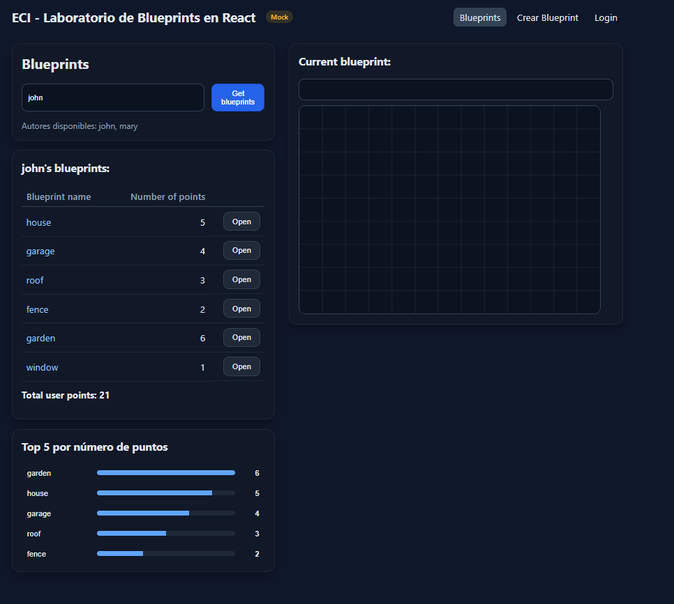

**Evidencia 23 – Estado de carga (red lenta, backend real):**

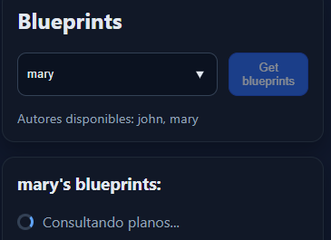

### 7.3 Seleccionar un plano y graficarlo

Al pulsar **Open** se despacha `fetchBlueprint`:

```js
const openBlueprint = (bp) => {
  const arg = { author: bp.author, name: bp.name }
  setLastOpened(arg)
  dispatch(fetchBlueprint(arg))
}
```

El plano queda en `state.blueprints.current` y el campo de texto **Current blueprint** (solo lectura) muestra su nombre:

```jsx
<h3 style={{ marginTop: 0 }}>Current blueprint:</h3>
<input
  className="input"
  aria-label="Plano actual"
  readOnly
  value={current ? current.name : ''}
/>
```

`BlueprintCanvas` recibe los puntos y dibuja los segmentos consecutivos, marcando cada punto:

```js
// Segmentos consecutivos
if (points.length > 1) {
  ctx.strokeStyle = '#93c5fd'
  ctx.lineWidth = 2
  ctx.beginPath()
  ctx.moveTo(points[0].x, points[0].y)
  for (let i = 1; i < points.length; i++) {
    ctx.lineTo(points[i].x, points[i].y)
  }
  ctx.stroke()
}

// Marca de cada punto
ctx.fillStyle = '#fbbf24'
for (const p of points) {
  ctx.beginPath()
  ctx.arc(p.x, p.y, 4, 0, Math.PI * 2)
  ctx.fill()
}
```

**Evidencia 4 – Plano `garage` abierto y graficado:**

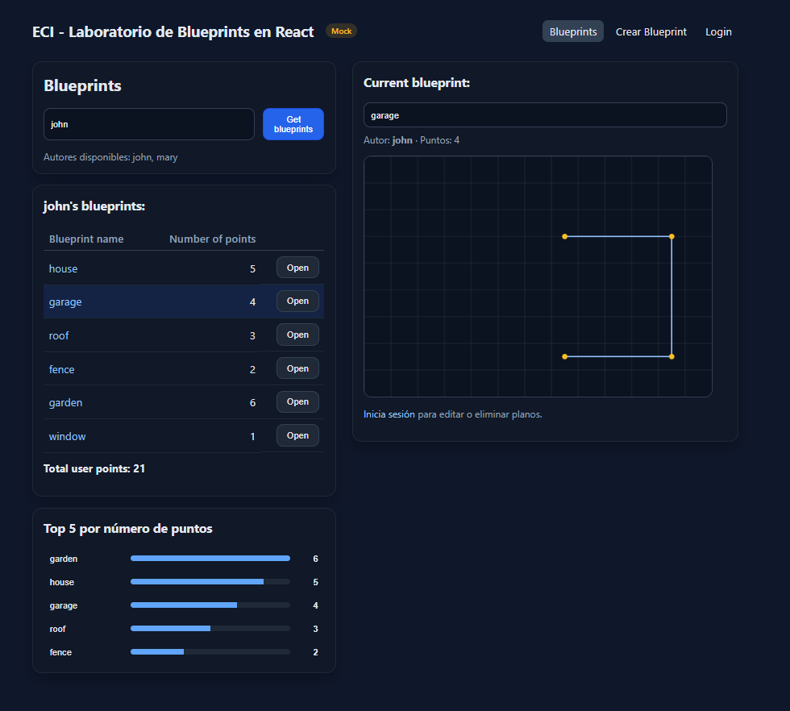

### 7.4 Servicios apimock y apiclient

El cambio entre implementaciones se hace con **una sola línea** en `src/services/blueprintsService.js`, según la variable del `.env`:

```js
import apiclient from './apiClient.js'
import apimock from './apimock.js'

// Única línea que decide la implementación: VITE_USE_MOCK=true usa el mock, false el API real
export const USE_MOCK = import.meta.env.VITE_USE_MOCK === 'true'

const blueprintsService = USE_MOCK ? apimock : apiclient

export default blueprintsService
```

**`apiClient.js`** – consume el API REST real con Axios:

```js
const apiClient = {
  getAll: async () => {
    const { data } = await api.get('/blueprints')
    return data
  },
  getByAuthor: async (author) => {
    const { data } = await api.get(path(author))
    return data
  },
  getByAuthorAndName: async (author, name) => {
    const { data } = await api.get(path(author, name))
    return data
  },
  create: async (blueprint) => {
    await api.post('/blueprints', blueprint)
    return blueprint
  },
  // El backend expone PUT /blueprints/{author}/{name}/points que agrega UN punto por petición
  addPoints: async (author, name, points) => {
    for (const p of points) {
      await api.put(`${path(author, name)}/points`, p)
    }
    return { author, name, points }
  },
  remove: async (author, name) => {
    await api.delete(path(author, name))
    return { author, name }
  },
}
```

**`apimock.js`** – misma interfaz con datos en memoria. Simula 300 ms de latencia y **siempre devuelve copias** (Redux congela lo que guarda en el store):

```js
const clone = (value) => structuredClone(value)
const delay = (ms = 300) => new Promise((resolve) => setTimeout(resolve, ms))

const apimock = {
  getAll: async () => {
    await delay()
    return clone(data)
  },
  getByAuthor: async (author) => {
    await delay()
    const bps = data.filter((bp) => bp.author === author)
    if (bps.length === 0) throw new Error(`El autor "${author}" no tiene planos registrados.`)
    return clone(bps)
  },
  getByAuthorAndName: async (author, name) => {
    await delay()
    const bp = find(author, name)
    if (!bp) throw new Error(`No existe el plano "${name}" de "${author}".`)
    return clone(bp)
  },
  create: async (blueprint) => {
    await delay()
    if (find(blueprint.author, blueprint.name)) {
      throw new Error(`Ya existe el plano "${blueprint.name}" de "${blueprint.author}".`)
    }
    data.push(clone(blueprint))
    return clone(blueprint)
  },
  addPoints: async (author, name, points) => { /* agrega los puntos al plano */ },
  remove: async (author, name) => { /* elimina el plano */ },
}
```

| Método | apimock | apiClient |
|--------|---------|-----------|
| `getAll()` | Copia de los datos en memoria | `GET /blueprints` |
| `getByAuthor(author)` | Filtra por autor (error si no hay planos) | `GET /blueprints/{author}` |
| `getByAuthorAndName(author, name)` | Busca el plano | `GET /blueprints/{author}/{name}` |
| `create(blueprint)` | Agrega (error si ya existe) | `POST /blueprints` |
| `addPoints(author, name, points)` | Agrega los puntos | Un `PUT .../points` por punto |
| `remove(author, name)` | Elimina | `DELETE /blueprints/{author}/{name}` |

La insignia **Mock** / **API** del encabezado indica el servicio activo. Las pruebas verifican que ambos servicios exponen los mismos métodos y que `VITE_USE_MOCK` selecciona la implementación correcta.

### 7.5 Interfaz con React

- El plano actual (`current`), el autor consultado (`selectedAuthor`), los planos por autor (`byAuthor`) y el estado de cada petición viven en el **store de Redux** y se leen con `useSelector`.
- No se manipula el DOM directamente: el lienzo se controla con `useRef` dentro de su componente y el resto se renderiza de forma declarativa.

```js
export const initialState = {
  authors: [],
  byAuthor: {},
  // Último autor consultado (permite reintentar la consulta)
  selectedAuthor: '',
  current: null,
  // Cantidad de puntos de `current` que ya están persistidos en el backend
  savedPointsCount: 0,
  // Estado de carga/error independiente por thunk
  requests: Object.fromEntries(Object.keys(THUNKS).map((key) => [key, idle])),
  // Plano eliminado de forma optimista, para poder reinsertarlo si falla
  pendingDelete: null,
}
```

**Evidencia 5 – Redux DevTools: acciones despachadas (`fetchAuthors/pending` → `fulfilled`) y el estado global con los slices `blueprints` y `auth`:**

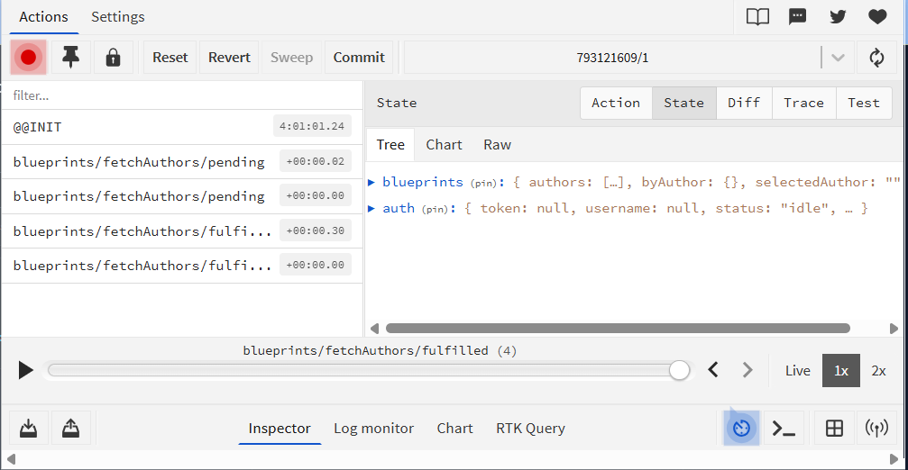

### 7.6 Estilos

`src/styles.css` define un tema oscuro coherente: tarjetas, tabla con fila seleccionada, botones (primario, secundario, peligro, deshabilitado), avisos de error e información, insignias, *spinner* animado, ranking con barras y diseño *responsive*:

```css
.page-grid {
  display: grid;
  grid-template-columns: 1.1fr 1.4fr;
  gap: 24px;
}
@media (max-width: 860px) {
  .page-grid,
  .form-layout {
    grid-template-columns: 1fr;
  }
}
```

**Evidencia 17 – Vista responsive:**

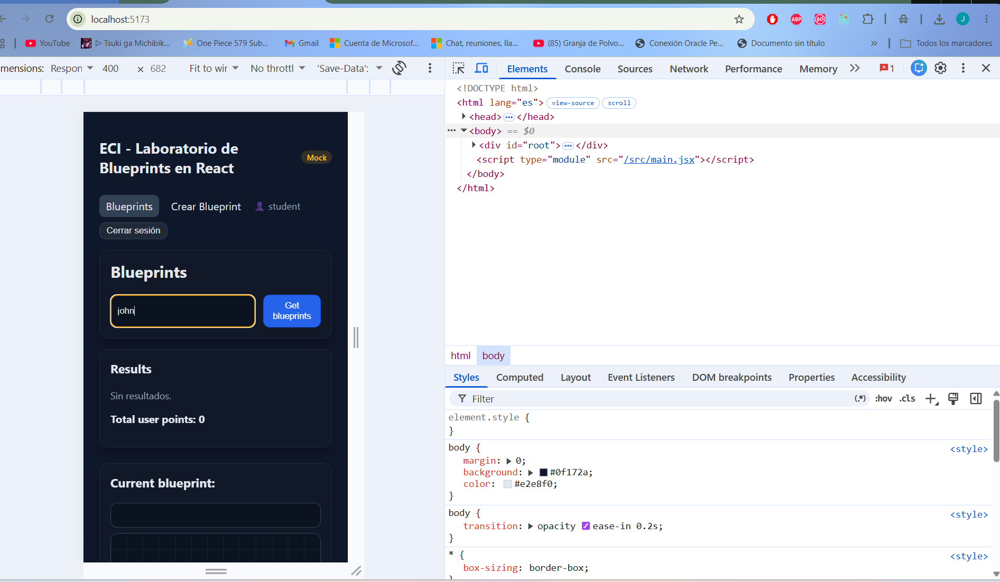

### 7.7 Pruebas unitarias

| Archivo | Pruebas | Qué valida |
|---------|---------|------------|
| `BlueprintCanvas.test.jsx` | 4 | Render y `getContext`; `id` y 520×360; clic → coordenadas; solo lectura |
| `BlueprintForm.test.jsx` | 5 | Envío con puntos parseados; JSON inválido; campos obligatorios; clic en el lienzo; error del backend |
| `BlueprintsPage.test.jsx` | 7 | Dispatch de `fetchByAuthor`; tabla con Open; Open actualiza el estado global; Top‑5; aviso + Reintentar; Eliminar solo con sesión |
| `blueprintsSlice.test.jsx` | 12 | Estado inicial; loading/error por thunk; reductores; reversión optimista; selectores y memoización |
| `auth.test.jsx` | 5 | Login correcto/incorrecto; logout; `PrivateRoute` redirige o muestra el contenido |
| `services.test.jsx` | 11 | Misma interfaz; copias del mock; PUT por punto; cambio mock/API; interceptores JWT, 401 y mensajes de error |

Configuración (`vitest.config.js`) con `globals: true`, jsdom y el mock activo:

```js
test: {
  globals: true,
  environment: 'jsdom',
  setupFiles: './tests/setup.js',
  // Las pruebas usan el mock salvo que indiquen lo contrario
  env: { VITE_USE_MOCK: 'true' },
},
```

`tests/setup.js` registra `@testing-library/jest-dom` y un mock de `HTMLCanvasElement.prototype.getContext` para jsdom.

Ejemplo – **render del canvas**:

```jsx
it('tiene identificador propio y dimensiones 520x360 por defecto', () => {
  const { container } = render(<BlueprintCanvas />)
  const canvas = container.querySelector('canvas')
  expect(canvas).toHaveAttribute('id', 'blueprint-canvas')
  expect(canvas).toHaveAttribute('width', '520')
  expect(canvas).toHaveAttribute('height', '360')
})
```

Ejemplo – **envío del formulario**:

```jsx
it('envía el formulario con puntos parseados', () => {
  const onSubmit = vi.fn()
  render(<BlueprintForm onSubmit={onSubmit} />)
  fill('john', 'house', '[{"x":1,"y":2}]')
  fireEvent.submit(screen.getByText(/Guardar/i))
  expect(onSubmit).toHaveBeenCalledWith({ author: 'john', name: 'house', points: [{ x: 1, y: 2 }] })
})
```

Ejemplo – **interacción con Redux (dispatch de `fetchByAuthor`)**:

```jsx
it('despacha fetchByAuthor al hacer click en Get blueprints', () => {
  const { actions } = setup()
  search('JohnConnor')
  expect(actions).toContain('blueprints/fetchByAuthor/pending')
})
```

**Evidencia 29 – Ejecución de `npm test`:**

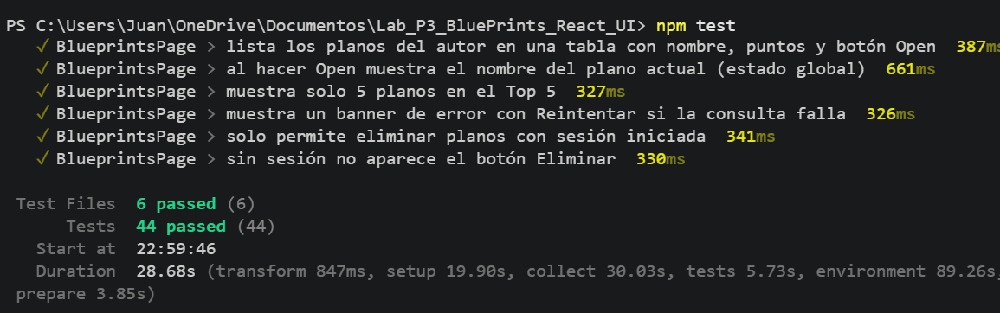

---

## 8. Actividades sugeridas

### 8.1 Redux avanzado

**Estados `loading/error` por thunk.** Cada operación tiene su propio estado en `state.blueprints.requests`, actualizado de forma genérica con `builder.addMatcher`:

```js
// Estados de carga/error comunes a todos los thunks (los matchers van después de los cases)
for (const [key, thunk] of Object.entries(THUNKS)) {
  builder
    .addMatcher(thunk.pending.match, (s) => {
      s.requests[key] = { status: 'loading', error: null }
    })
    .addMatcher(thunk.fulfilled.match, (s) => {
      s.requests[key] = { status: 'succeeded', error: null }
    })
    .addMatcher(thunk.rejected.match, (s, a) => {
      s.requests[key] = { status: 'failed', error: a.payload ?? a.error.message }
    })
}
```

Los errores llegan a la UI como mensajes legibles gracias a `rejectWithValue`:

```js
// Envuelve la llamada al servicio para que el error llegue a la UI como mensaje legible
const withMessage =
  (fn) =>
  async (arg, { rejectWithValue }) => {
    try {
      return await fn(arg)
    } catch (err) {
      return rejectWithValue(toErrorMessage(err))
    }
  }
```

`toErrorMessage` (`src/services/http.js`) traduce 401, 403, 404, 5xx y falta de conexión, y usa el mensaje del backend cuando lo envía (por ejemplo, *"Blueprint already exists"*). Cada sección muestra su propio *spinner* y su propio aviso.

**Selector memorizado Top‑5** (`src/features/blueprints/selectors.js`):

```js
// Memo selector: top-5 de planos del autor con más puntos
export const selectTop5ByPoints = createSelector([selectBlueprintsByAuthor], (items) =>
  [...items].sort((a, b) => (b.points?.length || 0) - (a.points?.length || 0)).slice(0, 5),
)
```

La tabla muestra **todos** los planos del autor y el Top‑5 va en una tarjeta aparte (evidencia 3). Una prueba verifica la memoización:

```js
it('selectTop5ByPoints está memoizado', () => {
  expect(selectTop5ByPoints(state, 'john')).toBe(selectTop5ByPoints(state, 'john'))
})
```

### 8.2 Rutas protegidas

`PrivateRoute` (`src/components/PrivateRoute.jsx`) consulta la sesión en Redux:

```jsx
export default function PrivateRoute({ children }) {
  const isAuthenticated = useSelector(selectIsAuthenticated)
  const location = useLocation()
  if (!isAuthenticated) {
    // Se recuerda la ruta original para volver a ella después del login
    return <Navigate to="/login" replace state={{ from: location.pathname }} />
  }
  return children
}
```

Uso en `App.jsx`:

```jsx
<Route
  path="/create"
  element={
    <PrivateRoute>
      <CreateBlueprintPage />
    </PrivateRoute>
  }
/>
```

En la página principal la edición y la eliminación solo se habilitan con sesión. El encabezado muestra el usuario y un botón **Cerrar sesión**.

**JWT e interceptores** (`src/services/http.js`):

```js
api.interceptors.request.use((config) => {
  const token = localStorage.getItem(TOKEN_KEY)
  if (token) {
    config.headers.Authorization = `Bearer ${token}`
  }
  return config
})

api.interceptors.response.use(
  (res) => res,
  (err) => {
    if (err.response?.status === 401) {
      // Token ausente, inválido o expirado: se limpia la sesión y se avisa a la app
      localStorage.removeItem(TOKEN_KEY)
      window.dispatchEvent(new Event(UNAUTHORIZED_EVENT))
    }
    return Promise.reject(err)
  },
)
```

En `main.jsx` el evento cierra la sesión en Redux:

```js
window.addEventListener(UNAUTHORIZED_EVENT, () => store.dispatch(logout()))
```

El login lee el `access_token` que devuelve el backend (`src/services/authService.js`):

```js
const realAuth = {
  login: async (username, password) => {
    const { data } = await api.post('/auth/login', { username, password })
    // El backend responde { access_token, token_type, expires_in }
    return data.access_token ?? data.token
  },
}
```

**Evidencia 7 – `/create` sin sesión → login:**

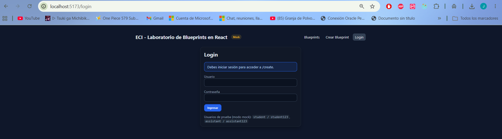

**Evidencia 8 – Sesión iniciada (usuario y token en Local Storage):**

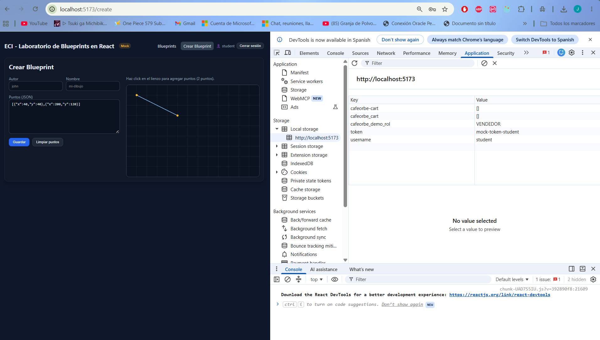

### 8.3 CRUD completo

| Operación | Thunk | Comportamiento |
|-----------|-------|----------------|
| Crear | `createBlueprint` | Formulario en `/create`; vuelve al listado consultando el autor creado |
| Leer | `fetchAuthors`, `fetchByAuthor`, `fetchBlueprint` | Tabla, lienzo y detalle |
| Actualizar | `saveBlueprint` | Envía solo los puntos nuevos; **optimista** |
| Eliminar | `deleteBlueprint` | Botón **Eliminar**; **optimista** |

**Guardado optimista** – la tabla se actualiza en `pending` y se revierte en `rejected`:

```js
.addCase(saveBlueprint.pending, (s, a) => {
  const { author, name, newPoints, previousPoints } = a.meta.arg
  const items = s.byAuthor[author]
  const i = findIndex(items, name)
  if (i !== -1) items[i].points = [...previousPoints, ...newPoints]
})
.addCase(saveBlueprint.rejected, (s, a) => {
  const { author, name, previousPoints } = a.meta.arg
  const items = s.byAuthor[author]
  const i = findIndex(items, name)
  if (i !== -1) items[i].points = previousPoints
})
```

**Eliminación optimista** – la fila se quita en `pending` y se reinserta en su posición si falla:

```js
.addCase(deleteBlueprint.pending, (s, a) => {
  const { author, name } = a.meta.arg
  const items = s.byAuthor[author]
  const i = findIndex(items, name)
  if (i !== -1) {
    s.pendingDelete = { author, index: i, item: items[i] }
    items.splice(i, 1)
  }
})
.addCase(deleteBlueprint.rejected, (s) => {
  const pending = s.pendingDelete
  if (pending && s.byAuthor[pending.author]) {
    s.byAuthor[pending.author].splice(pending.index, 0, pending.item)
  }
  s.pendingDelete = null
})
```

**Evidencia 12 – Crear blueprint (formulario + lienzo):**

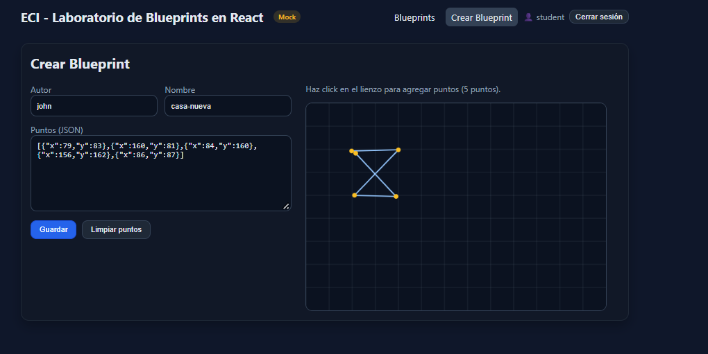

**Evidencia 13 – Blueprint creado en el listado:**

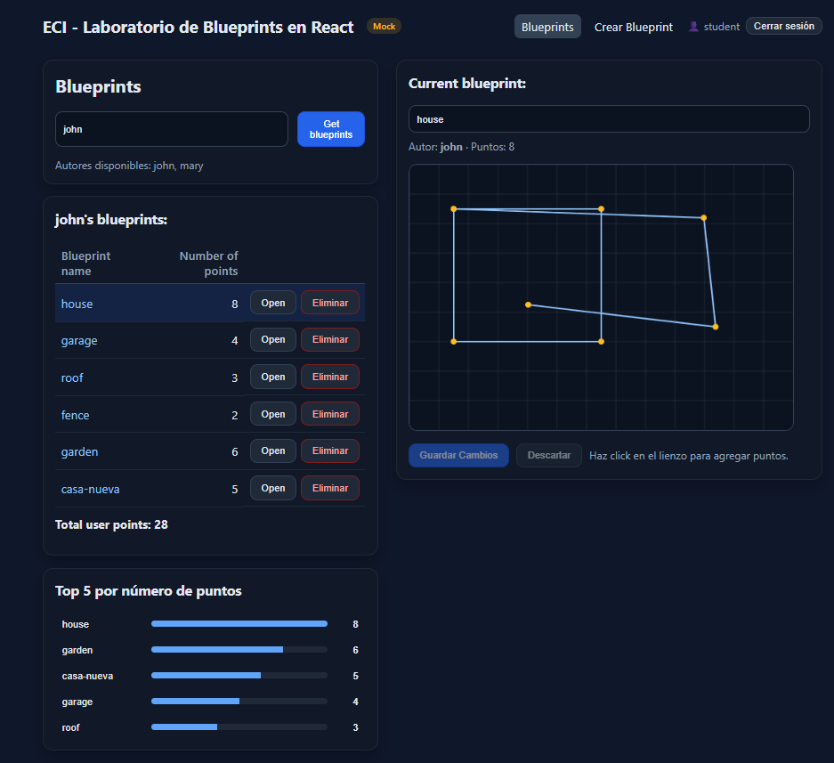

**Evidencia 14 – Validación del formulario:**

*a) JSON de puntos mal formado → "JSON de puntos inválido.":*

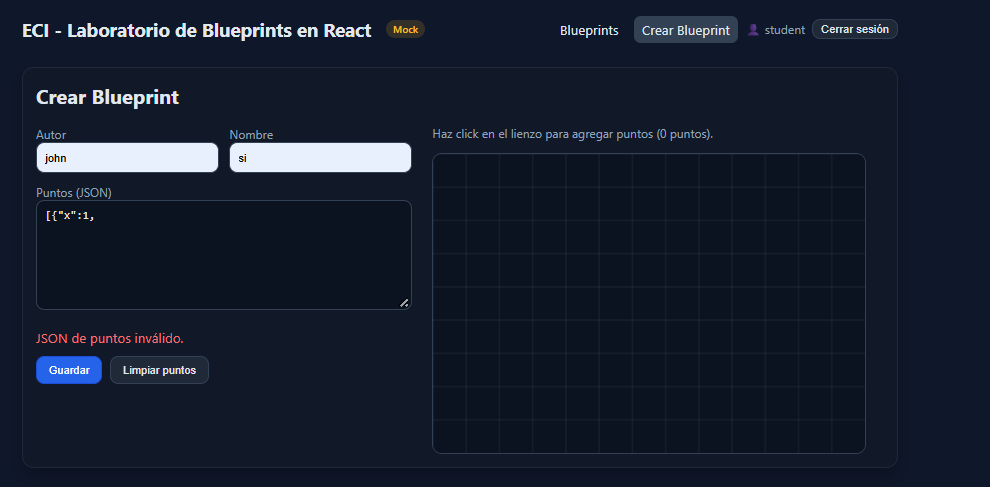

*b) Autor y nombre vacíos → "El autor y el nombre son obligatorios.":*

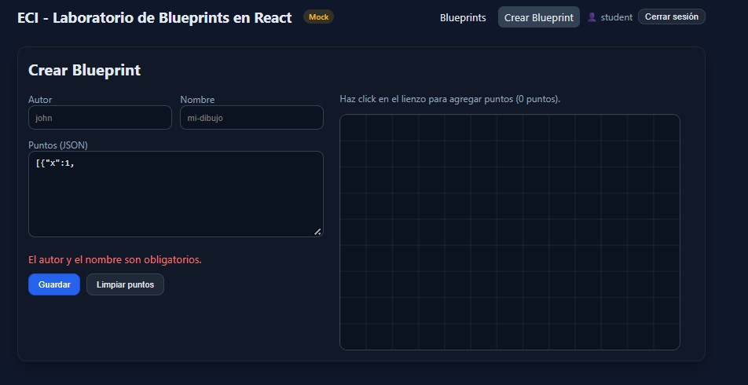

**Evidencia 11 – Plano eliminado:**

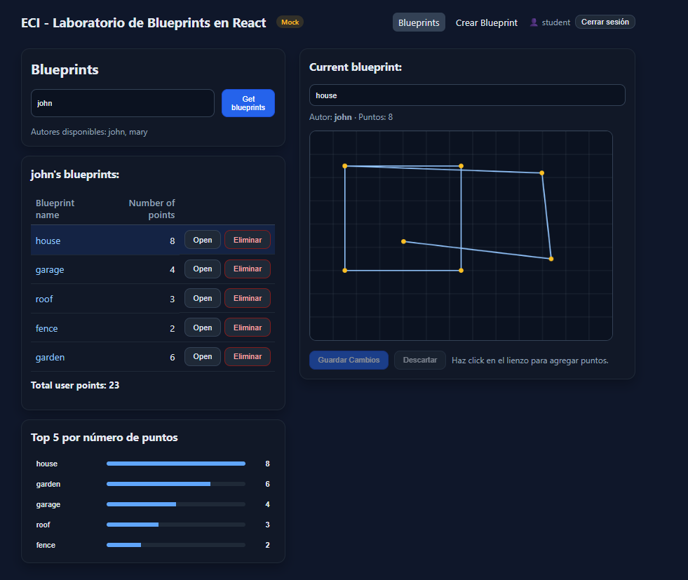

### 8.4 Dibujo interactivo

El SVG de la página de detalle se reemplazó por `BlueprintCanvas`. Cada clic en el lienzo calcula las coordenadas, escaladas por si el CSS redimensiona el canvas:

```js
const handleClick = (e) => {
  if (!onAddPoint) return
  const canvas = ref.current
  const rect = canvas.getBoundingClientRect()
  // Escala real por si el CSS redimensiona el canvas
  const scaleX = rect.width ? canvas.width / rect.width : 1
  const scaleY = rect.height ? canvas.height / rect.height : 1
  const x = Math.round((e.clientX - rect.left) * scaleX)
  const y = Math.round((e.clientY - rect.top) * scaleY)
  onAddPoint({ x, y })
}
```

Con un plano abierto y sesión iniciada, el punto se agrega al estado con `addPointToCurrent`. El selector `selectUnsavedPoints` calcula los puntos pendientes, que se muestran en una insignia:

```js
// Puntos agregados en el canvas que aún no se han guardado
export const selectUnsavedPoints = createSelector(
  [selectCurrent, (state) => state.blueprints.savedPointsCount],
  (current, saved) => (current ? current.points.slice(saved) : EMPTY),
)
```

**Guardar Cambios** envía solo esos puntos:

```js
const handleSave = () => {
  if (!current || !unsavedPoints.length) return
  dispatch(
    saveBlueprint({
      author: current.author,
      name: current.name,
      previousPoints: current.points.slice(0, current.points.length - unsavedPoints.length),
      newPoints: unsavedPoints,
    }),
  )
}
```

**Descartar** (`discardChanges`) elimina los puntos no guardados. En `/create` el mismo lienzo agrega puntos al JSON del formulario.

**Evidencia 9 – Puntos agregados con clic:**

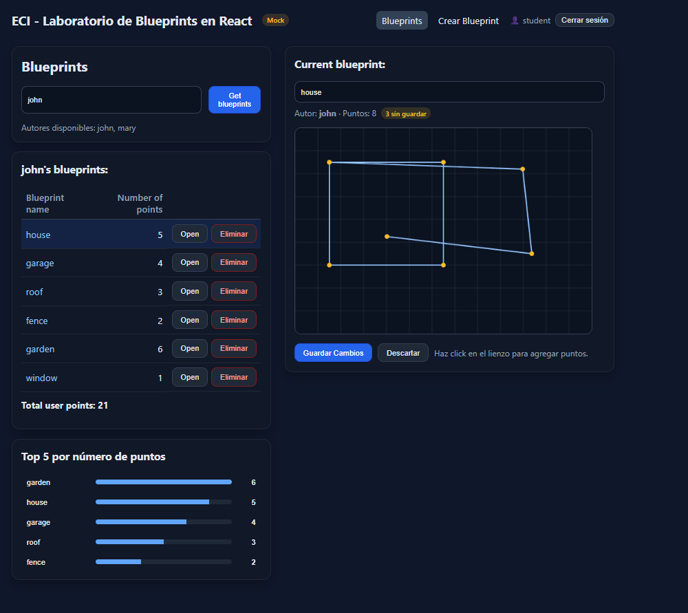

**Evidencia 10 – Cambios guardados:**

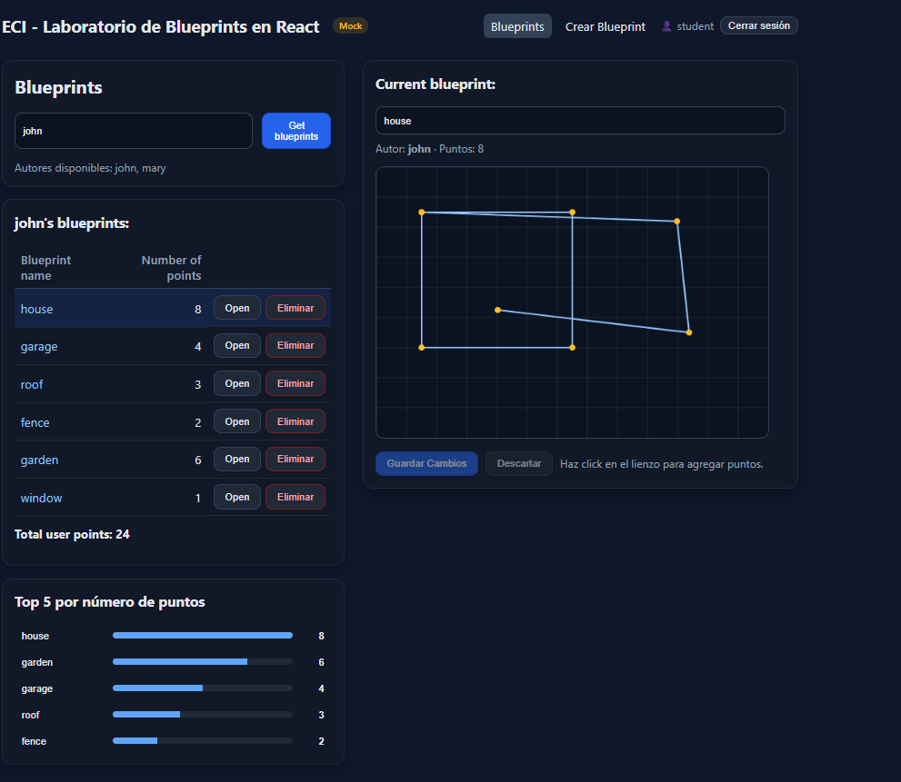

**Evidencia 15 – Página de detalle:**

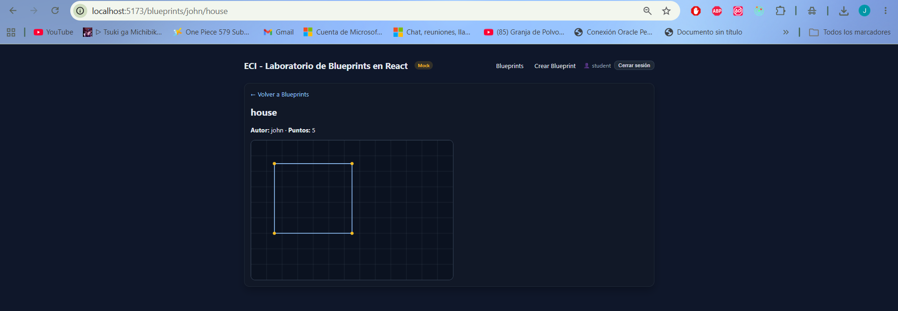

### 8.5 Errores y Retry

`ErrorBanner` muestra el mensaje y un botón **Reintentar** que vuelve a despachar el thunk que falló:

```jsx
export default function ErrorBanner({ message, onRetry, onClose }) {
  if (!message) return null
  return (
    <div className="banner error" role="alert">
      <span>{message}</span>
      <div className="banner-actions">
        {onRetry && (
          <button type="button" className="btn small" onClick={onRetry}>
            Reintentar
          </button>
        )}
        {/* ... botón cerrar */}
      </div>
    </div>
  )
}
```

Uso para la consulta por autor:

```jsx
<ErrorBanner
  message={listReq.error}
  onRetry={() => selectedAuthor && dispatch(fetchByAuthor(selectedAuthor))}
  onClose={() => dispatch(clearError('fetchByAuthor'))}
/>
```

Hay avisos independientes para autores, consulta por autor, abrir plano, guardar y eliminar.

**Evidencia 6 – Autor inexistente con Reintentar:**

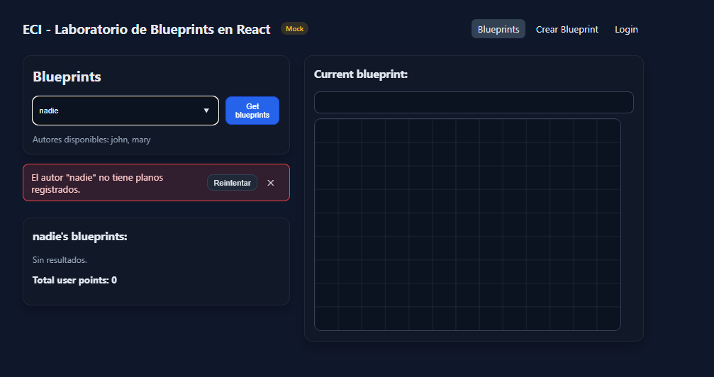

**Evidencia 16 – Página 404:**

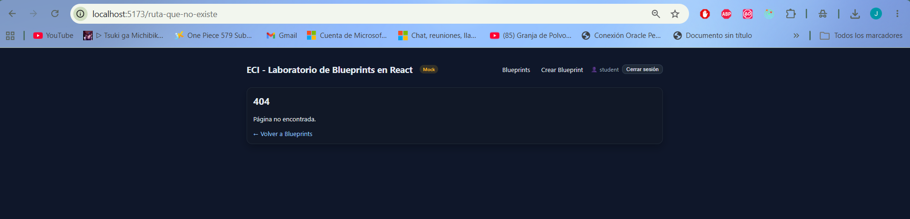

### 8.6 Testing

Ver [7.7 Pruebas unitarias](#77-pruebas-unitarias): reductores puros del slice (incluidas las reversiones optimistas) y componentes con Testing Library. Ejemplo de reductor puro con reversión:

```js
it('deleteBlueprint es optimista y reinserta el plano si falla', () => {
  const arg = { author: 'john', name: 'b' }
  let state = withAuthor([bp('a', 1), bp('b', 2), bp('c', 3)])
  state = reducer(state, deleteBlueprint.pending('req', arg))
  expect(state.byAuthor.john.map((b) => b.name)).toEqual(['a', 'c'])

  state = reducer(state, deleteBlueprint.rejected(null, 'req', arg, 'Error'))
  expect(state.byAuthor.john.map((b) => b.name)).toEqual(['a', 'b', 'c'])
})
```

### 8.7 CI/Lint/Format

`.github/workflows/ci.yml` se ejecuta en cada *push* y *pull request*:

```yaml
steps:
  - uses: actions/checkout@v4
  - uses: actions/setup-node@v4
    with:
      node-version: 20
      cache: 'npm'
  - run: npm ci || npm install
  - run: npm run lint
  - run: npm test
  - run: npm run build
```

El `package-lock.json` está versionado para que `npm ci` sea reproducible.

**Evidencia 30 – Lint y build:**

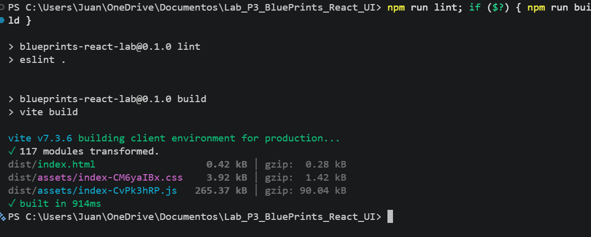

**Evidencia 31 – GitHub Actions:**

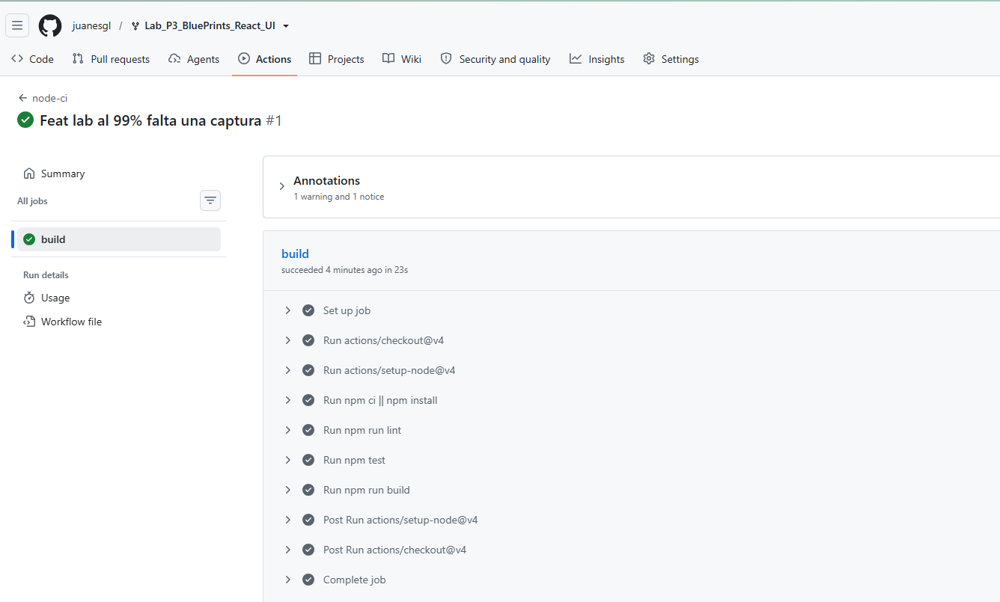

### 8.8 Docker (opcional)

`Dockerfile` multi‑etapa: Node compila y nginx sirve la SPA y hace de proxy.

```dockerfile
FROM node:20-alpine AS build
WORKDIR /app
COPY package*.json ./
RUN npm ci
COPY . .
ARG VITE_USE_MOCK=false
ARG VITE_API_BASE_URL=/api
ENV VITE_USE_MOCK=$VITE_USE_MOCK VITE_API_BASE_URL=$VITE_API_BASE_URL
RUN npm run build

FROM nginx:1.27-alpine
ENV BACKEND_URL=http://backend:8080
COPY docker/nginx.conf.template /etc/nginx/templates/default.conf.template
COPY --from=build /app/dist /usr/share/nginx/html
EXPOSE 80
```

`docker-compose.yml` levanta `web`, `backend` (construido desde el repositorio de GitHub del Lab P2) y `db`. Ver [4.7](#47-docker-opcional). La imagen del frontend se verificó: sirve la SPA (incluido el *fallback* de rutas) y reenvía `/api` al backend con y sin token.

> La ejecución con Docker Compose es **opcional** en el enunciado; su funcionamiento se describe en la sección [4.7](#47-docker-opcional) y no se incluye captura.

---

## 9. Punto de partida y errores corregidos

El trabajo se desarrolló sobre la rama `feat/canvas-y-tests`, que partía de la plantilla del laboratorio con estos avances: `id` y `data-testid` en el canvas, `htmlFor` en las etiquetas del formulario, configuración de `tests/setup.js` y `package-lock.json` versionado. Todos se conservaron.

| # | Problema | Causa | Corrección |
|---|----------|-------|------------|
| 1 | El login guardaba `undefined` como token | Se leía `data.token`, pero el backend responde `access_token` | `authService` lee `access_token` |
| 2 | Todas las consultas al backend fallaban | La URL base usaba `/api` y el backend no tiene ese prefijo; además no tiene CORS | Proxy `/api` en Vite y nginx que elimina el prefijo |
| 3 | No existían `apimock` ni `blueprintsService` | El slice llamaba a Axios directamente | Servicios con la misma interfaz y cambio con `VITE_USE_MOCK` |
| 4 | El nombre del plano se mostraba en un título | El enunciado pide un campo de texto | Campo **Current blueprint** de solo lectura |
| 5 | `BlueprintForm` no se usaba en ninguna página | Faltaba la ruta de creación | Página `/create` protegida |
| 6 | Sin estado de carga ni errores al consultar por autor o abrir un plano | Los thunks no manejaban `pending`/`rejected` | Estado independiente por thunk y avisos con Reintentar |
| 7 | Guardar en el mock fallaba con `Cannot assign to read only property` (detectado durante el desarrollo) | El mock compartía referencias con el store, que Redux congela | El mock devuelve copias (`structuredClone`) y hay prueba de regresión |
| 8 | El guardado enviaba el arreglo completo de puntos | El backend recibe un punto por petición | Un PUT por punto |
| 9 | Ante un 401 la UI seguía creyendo que había sesión | El interceptor solo borraba `localStorage` | Evento de sesión expirada que despacha `logout` |
| 10 | `docker-compose.yml` apuntaba a una imagen inexistente | Plantilla sin completar | nginx con proxy y backend construido desde GitHub |
| 11 | El detalle podía mostrar un plano distinto al de la URL | Usaba `current` sin compararlo con la ruta | Se valida autor y nombre |
| 12 | No se podía probar la escritura contra el backend | Ningún usuario tenía `blueprints.write` y no existía `DELETE` | Cambios en el backend (sección 6.1) |
| 13 | Un plano duplicado se informaba como "Permisos insuficientes" | El backend usa 403 también para duplicados | Se muestra el mensaje que envía el backend cuando existe |

---

## 10. Evidencias con el backend real

Con `VITE_USE_MOCK=false` y el backend del Lab P2 (rama `feat/delete-y-scope-write`) en ejecución:

**Evidencia 19 – Sin sesión: la consulta responde 401:**

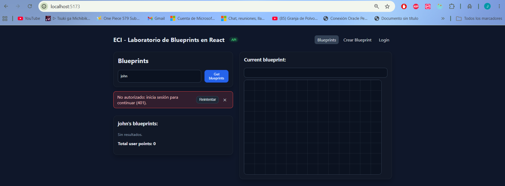

**Evidencia 20 – Network: `POST /api/auth/login` devuelve `access_token`:**

*a) Headers: `POST http://localhost:5173/api/auth/login` → `200 OK` (a través del proxy de Vite):*

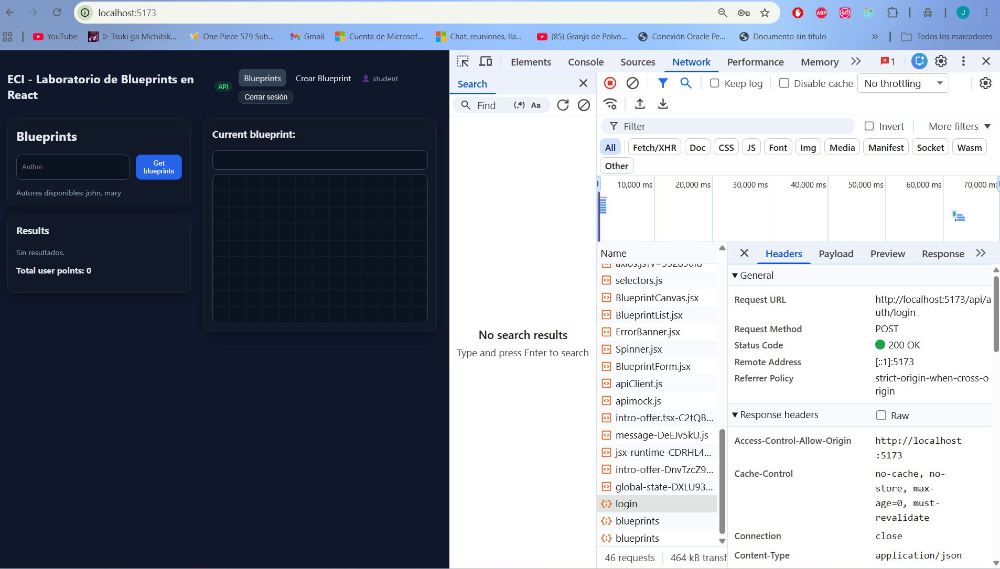

*b) Preview: respuesta con `access_token`, `token_type: "Bearer"` y `expires_in: 3600`:*

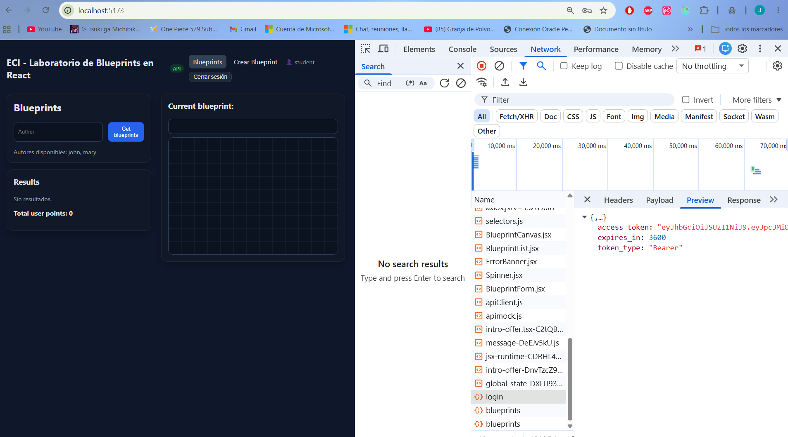

**Evidencia 21 – Tabla con datos del backend:**

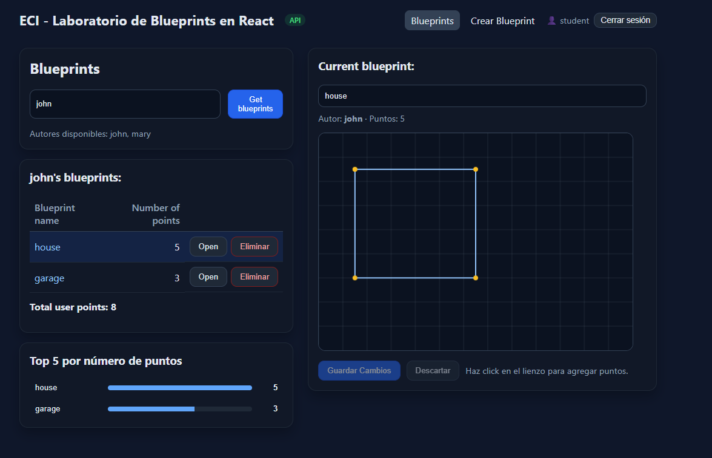

**Evidencia 22 – Network: con sesión iniciada, `GET /api/blueprints/john` responde `200 OK` (el interceptor adjunta `Authorization: Bearer ...`):**

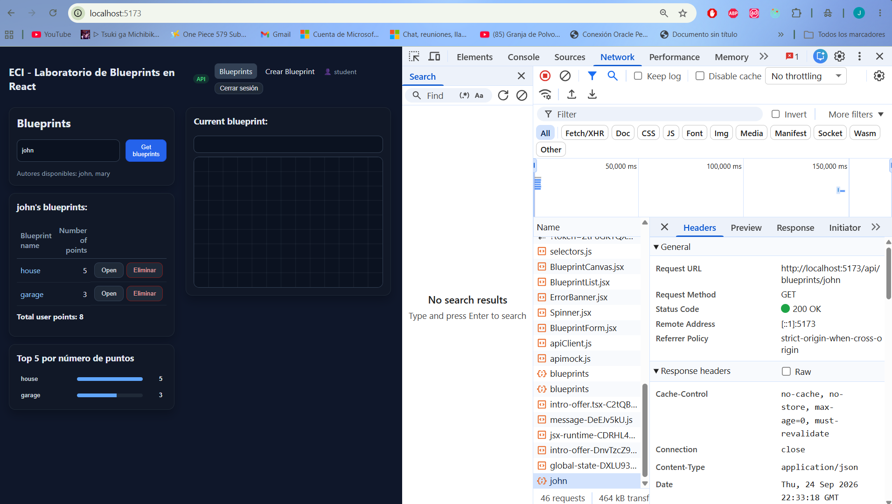

**Evidencia 24 – `student` (solo lectura) intenta guardar puntos → 403 y la tabla se restaura:**

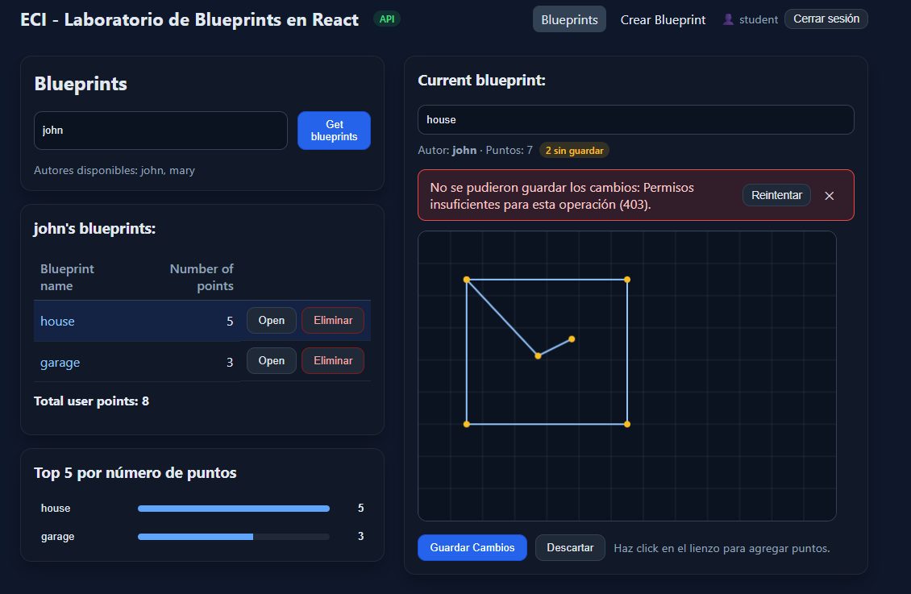

**Evidencia 25 – `student` intenta eliminar → 403 y el plano se reinserta (reversión optimista):**

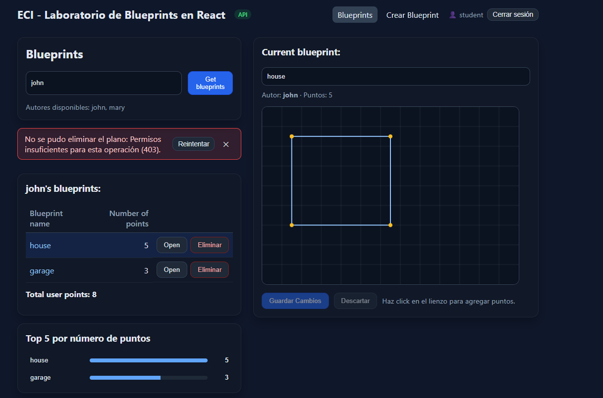

**Evidencia 26 – `assistant` crea el plano `casa-api` en el backend; al volver al listado, `GET /api/blueprints/john` (200) ya lo incluye con sus 4 puntos:**

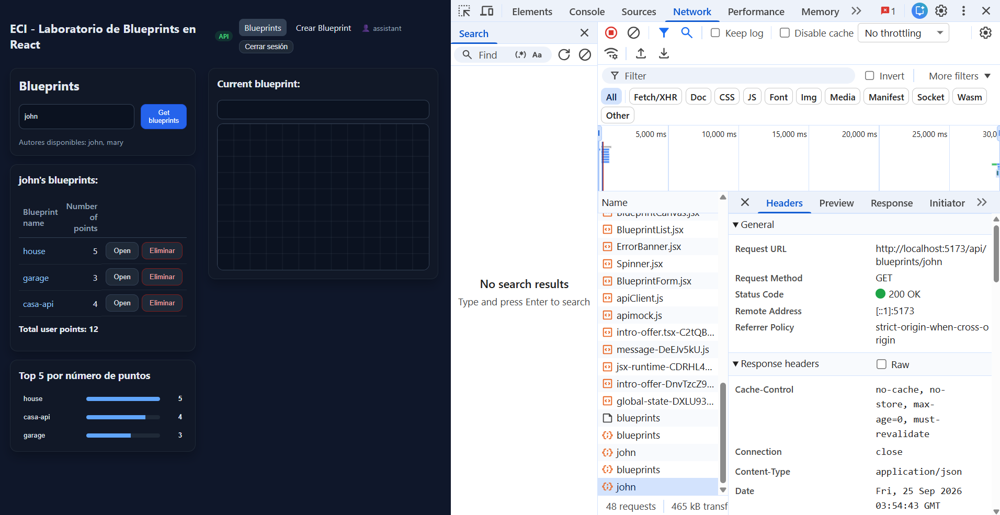

**Evidencia 27 – `assistant` agrega puntos y los guarda (persisten al recargar):**

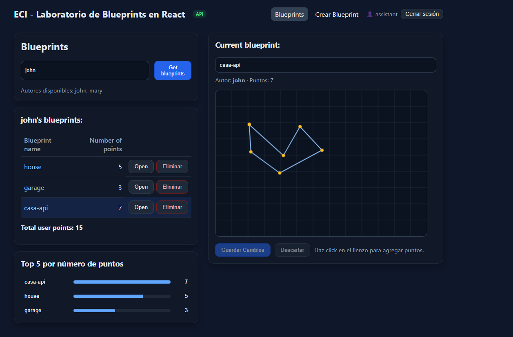

**Evidencia 28 – `assistant` elimina un plano (DELETE → 204):**

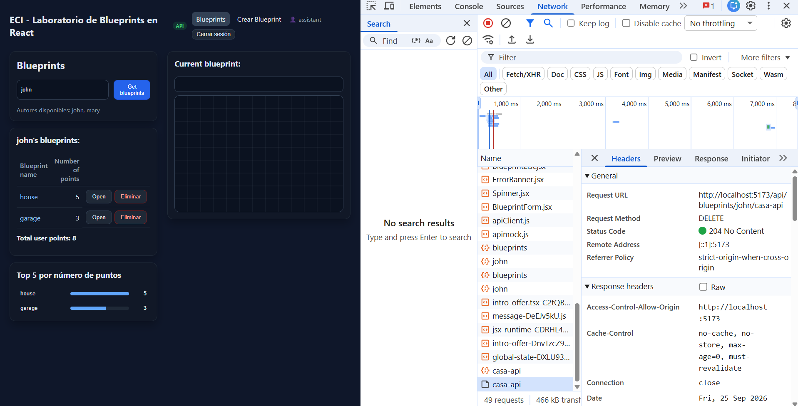

---

## 11. Solución de problemas

| Síntoma | Causa | Solución |
|---------|-------|----------|
| *"No se pudo conectar con el backend (500)"* | El backend no está corriendo | Iniciarlo o usar `VITE_USE_MOCK=true` |
| *"No autorizado: inicia sesión (401)"* | No hay token o expiró (1 hora) | Iniciar sesión de nuevo |
| *"Permisos insuficientes (403)"* al crear, guardar o eliminar | Sesión con `student` (solo lectura) | Iniciar sesión con `assistant / assistant123` |
| *"El backend no soporta esta operación (405)"* al eliminar | El backend no está en la rama `feat/delete-y-scope-write` | `git checkout feat/delete-y-scope-write` en el backend y reiniciarlo |
| *"Blueprint already exists … (403)"* | Ya existe un plano con ese autor y nombre | Usar otro nombre |
| El cambio en `.env` no tiene efecto | Vite solo lee `.env` al arrancar | Reiniciar `npm run dev` |

---

## 12. Conclusiones

- Separar la **fuente de datos** (mock o API) detrás de una interfaz común permitió desarrollar y probar toda la interfaz sin depender del backend, y cambiar a datos reales con una sola variable.
- Manejar el **estado de cada petición por separado** mejora la experiencia de usuario: cada sección informa su propia carga o error y puede reintentarse de forma independiente.
- Las **actualizaciones optimistas** hacen que la interfaz responda de inmediato, pero exigen guardar el estado previo para revertir; el usuario de solo lectura permitió comprobar ese camino contra el backend real.
- La integración real reveló diferencias entre el contrato propuesto y el backend (prefijos, formato del token, PUT por punto, ausencia de CORS, sin `DELETE` ni usuarios con escritura). Las de contrato se resolvieron en el frontend y las funcionales en el backend, manteniendo los dos repositorios independientes.
- La seguridad se implementó en capas: interceptor que adjunta el token, manejo del 401, sesión en Redux y rutas protegidas; la autorización real permanece en el backend, que responde 403 cuando falta el scope `blueprints.write`.
